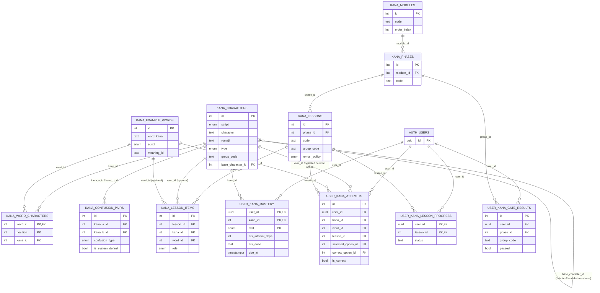

# Skema Sistem Kana

Sumber kebenaran: `db/schema/kana.ts` (Drizzle). Migration SQL: `db/migrations/0000_oval_karnak.sql`.
Folder ini terpisah dari `supabase/migrations/` (isi Fase 1: `profiles` + trigger, ditulis tangan) — dua sistem migrasi berjalan berdampingan, tidak saling mencampuri.

## ERD

## Tiga kelompok tabel

**Konten** (`kana_characters`, `kana_example_words`, `kana_word_characters`, `kana_confusion_pairs`) — data statis, sama untuk semua user. RLS: `SELECT` untuk role `authenticated`, tanpa policy insert/update/delete — konten diisi lewat koneksi langsung (migration/seed/service role), bukan lewat akses aplikasi biasa.

**Struktur belajar** (`kana_modules` → `kana_phases` → `kana_lessons` → `kana_lesson_items`) — hierarki tiga tingkat. `kana_lesson_items.kana_id`/`word_id` saling eksklusif (CHECK: tepat satu yang terisi) karena satu baris mengajarkan kana ATAU kata, tidak dua-duanya. RLS sama seperti tabel konten: baca publik untuk user terautentikasi.

**Progres user** (`user_kana_mastery`, `user_kana_attempts`, `user_kana_lesson_progress`, `user_kana_gate_results`) — RLS ketat: user hanya bisa SELECT/INSERT (dan UPDATE untuk mastery + lesson_progress) barisnya sendiri, dicek lewat `auth.uid() = user_id`. `user_kana_attempts` dan `user_kana_gate_results` sengaja tanpa policy UPDATE — keduanya log historis (jawaban yang sudah dikirim atau hasil tes yang sudah diambil tidak boleh diubah retroaktif).

## Kenapa `user_kana_mastery` dipecah per skill

Primary key `(user_id, kana_id, skill)` — satu karakter kana punya sampai 6 baris progres berbeda (visual/audio/recall/writing/reading/typing) per user. Ini memenuhi kebutuhan modul remediasi yang harus tahu bukan cuma *karakter mana* yang lemah, tapi *skill mana* dari karakter itu yang lemah — satu angka mastery gabungan tidak cukup untuk itu.

## Index yang sengaja ditambahkan

| Index | Tabel | Alasan |
|---|---|---|
| `(user_id, due_at)` | `user_kana_mastery` | Query SRS harian: "item apa yang jatuh tempo untuk user ini" — `user_id` di depan supaya bisa dipakai juga untuk lookup per-user tanpa `due_at`. |
| `(user_id, skill)` | `user_kana_mastery` | Query remediasi lintas-karakter ("semua skill 'writing' yang lemah untuk user ini"). Primary key tabel ini urutannya `(user_id, kana_id, skill)` — `skill` di posisi ketiga membuatnya tidak efisien dipakai sebagai filter tanpa `kana_id`, jadi index terpisah ini memang perlu, bukan sekadar duplikat PK. |
| `(user_id, kana_id)` | `user_kana_attempts` | Riwayat percobaan per karakter per user — dasar penghitungan confusion pair personal. |
| `(user_id, created_at)` | `user_kana_attempts` | Query "aktivitas terbaru" / pagination log. |
| `(user_id, phase_id)` | `user_kana_gate_results` | Riwayat hasil gate test per phase per user (mendukung retake). |
| unique `(script, character)` | `kana_characters` | Satu baris per glyph — mencegah duplikat data konten. |
| unique `(kana_a_id, kana_b_id)` + CHECK `kana_a_id < kana_b_id` | `kana_confusion_pairs` | Mencegah pasangan (A,B) dan (B,A) tercatat dua kali sebagai confusion pair berbeda. |
| unique `(lesson_id, kana_id)` / `(lesson_id, word_id)` | `kana_lesson_items` | Item yang sama tidak diajarkan dua kali di lesson yang sama. |

## Yang belum ada di scope ini

Tidak ada client Drizzle runtime (`db/client.ts`) — schema ini baru definisi + migration, belum ada kode aplikasi yang query lewat Drizzle. Env var baru `DATABASE_URL` (connection string Postgres langsung dari Supabase, bukan `NEXT_PUBLIC_*`) dibutuhkan untuk menjalankan migration ini, dan nanti untuk client runtime.
